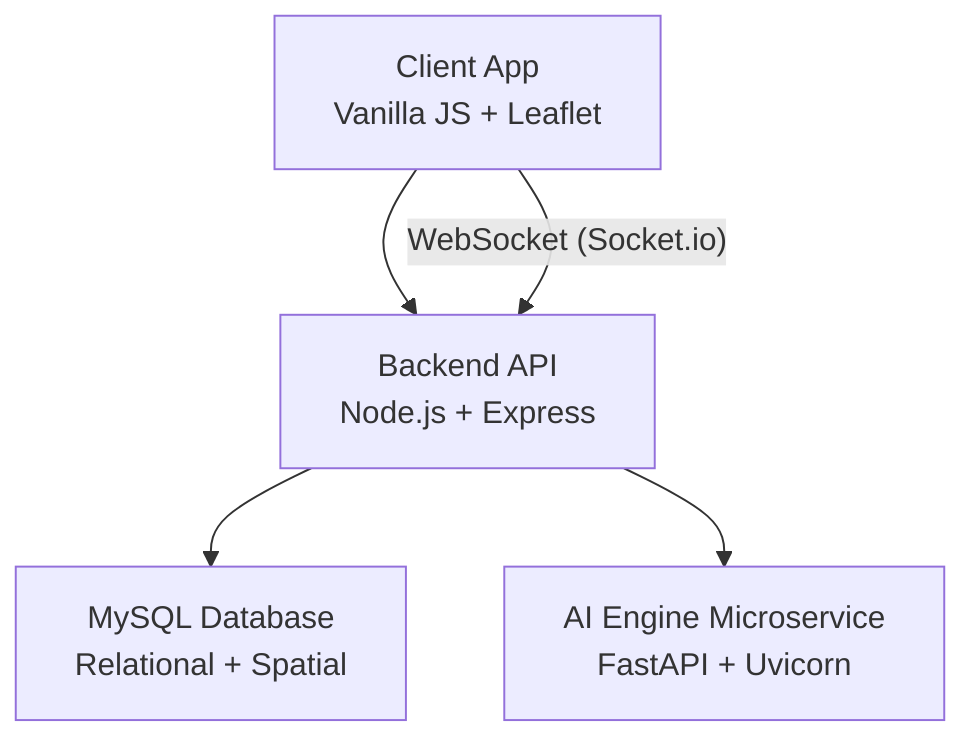
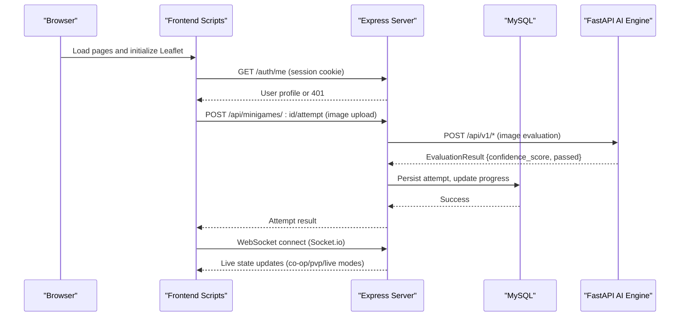
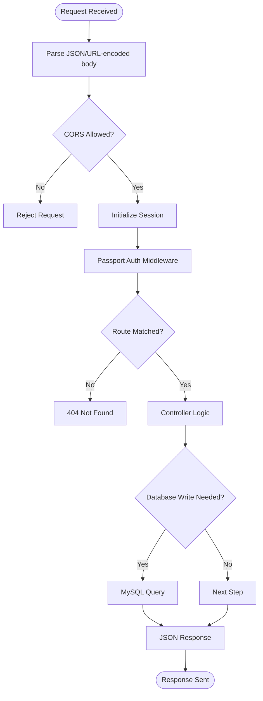
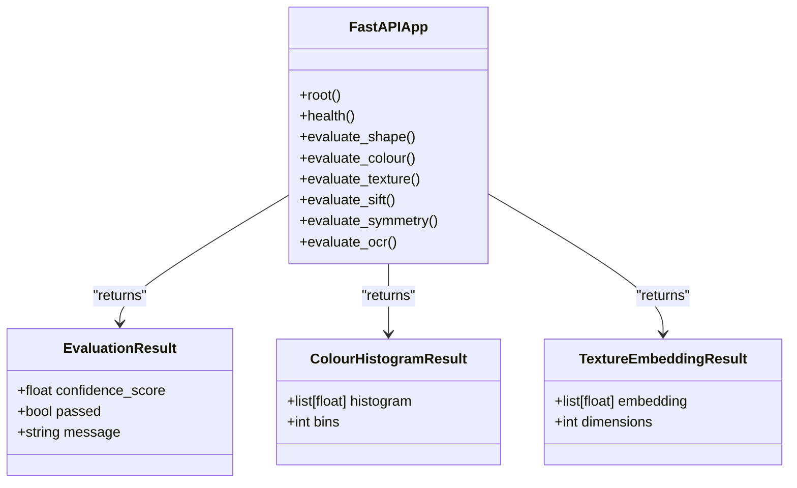
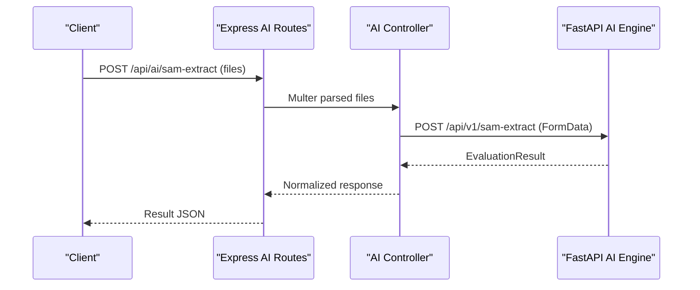
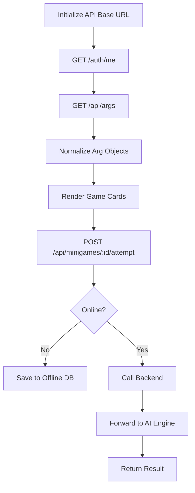
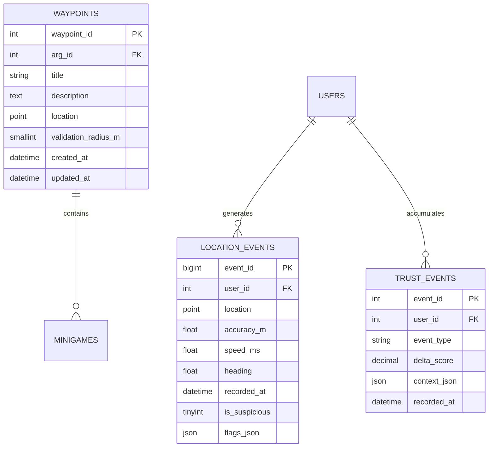
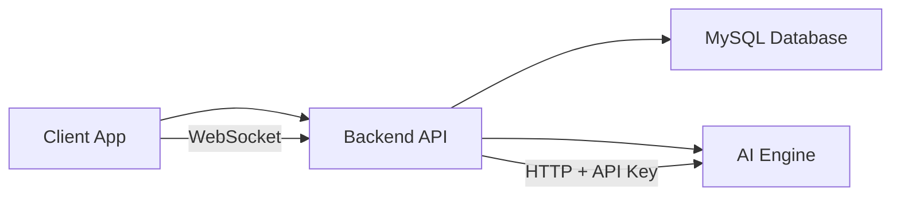

# Overall System Design

<cite>
**Referenced Files in This Document**
- [README.md](file://README.md)
- [server.js](file://server/server.js)
- [app.js](file://server/src/app.js)
- [aiRoutes.js](file://server/src/routes/aiRoutes.js)
- [aiController.js](file://server/src/controllers/aiController.js)
- [main.py](file://ai-engine/main.py)
- [schema.sql](file://database/schema.sql)
- [api.js](file://client/scripts/api.js)
- [deployment-guide.md](file://warg-docs/docs/4-deployment/deployment-guide.md)
- [third-party-code.md](file://warg-docs/docs/8-third-party/third-party-code.md)
- [implementation-details.md](file://warg-docs/docs/2-architecture-and-design/implementation-details.md)
</cite>

## Table of Contents
1. [Introduction](#introduction)
2. [Project Structure](#project-structure)
3. [Core Components](#core-components)
4. [Architecture Overview](#architecture-overview)
5. [Detailed Component Analysis](#detailed-component-analysis)
6. [Dependency Analysis](#dependency-analysis)
7. [Performance Considerations](#performance-considerations)
8. [Troubleshooting Guide](#troubleshooting-guide)
9. [Conclusion](#conclusion)

## Introduction
WARG Platform is a location-based Alternate Reality Game system that lets users create and play geospatial games on a university campus. The platform combines a Node.js backend API, a Python AI microservice for image-based minigame evaluation, a vanilla JavaScript frontend, and a MySQL database with spatial extensions. It supports basic gameplay, offline resilience, anti-spoofing heuristics, social features, and advanced live-play mechanics through WebSockets.

The system design emphasizes:
- Clear separation between HTTP API, real-time communication, AI evaluation, and persistent data.
- Security boundaries around authentication, authorization, and cross-service API keys.
- Scalability considerations for concurrent players, image uploads, and live multiplayer.

**Section sources**
- [README.md:16-76](file://README.md#L16-L76)

## Project Structure
The repository is organized into clear service boundaries:
- `client/`: Static HTML/CSS/JS application served by the backend or deployed to Vercel.
- `server/`: Node.js Express API, session management, routing, controllers, models, middleware, and Socket.io setup.
- `ai-engine/`: FastAPI microservice exposing image-processing endpoints for minigame evaluation.
- `database/`: MySQL schema including relational tables, spatial geometry columns, indexes, and views.
- `warg-docs/`: Documentation site covering architecture, deployment, and third-party dependencies.

**Diagram sources**
- [server.js:1-71](file://server/server.js#L1-L71)
- [app.js:1-132](file://server/src/app.js#L1-L132)
- [main.py:1-157](file://ai-engine/main.py#L1-L157)
- [schema.sql:1-691](file://database/schema.sql#L1-L691)

**Section sources**
- [README.md:62-108](file://README.md#L62-L108)
- [server.js:1-71](file://server/server.js#L1-L71)
- [app.js:1-132](file://server/src/app.js#L1-L132)
- [main.py:1-157](file://ai-engine/main.py#L1-L157)
- [schema.sql:1-691](file://database/schema.sql#L1-L691)

## Core Components
- Backend API (Node.js + Express): Handles authentication, game logic, user management, sessions, and proxies AI requests. Serves static client files and mounts WebSocket support.
- AI Engine (Python + FastAPI): Provides secure HTTP endpoints for shape matching, color matching, texture matching, SIFT comparison, symmetry detection, and OCR plaque scanning.
- Frontend (Vanilla JavaScript): Uses Leaflet for maps, fetches REST APIs, handles offline caching, and connects via WebSocket for live-play updates.
- Database (MySQL): Stores users, ARGs, waypoints, minigames, assets, sessions, progress, location events, trust events, ratings, comments, flags, badges, leaderboards, analytics, push subscriptions, and audit logs. Includes spatial SRID 4326 POINT columns and spatial indexes.

Technology stack decisions:
- Node.js/Express for backend: Mature ecosystem, strong concurrency model, easy integration with Passport, sessions, and Socket.io.
- FastAPI for AI service: High-performance async framework, automatic validation, and modern ML deployment patterns.
- Vanilla JavaScript frontend: Simple delivery, direct control over DOM and map interactions, and straightforward offline caching strategies.
- MySQL with spatial extensions: Robust relational storage with native geospatial capabilities for waypoint proximity checks and location tracking.

**Section sources**
- [README.md:62-76](file://README.md#L62-L76)
- [app.js:1-132](file://server/src/app.js#L1-L132)
- [main.py:1-157](file://ai-engine/main.py#L1-L157)
- [schema.sql:1-691](file://database/schema.sql#L1-L691)

## Architecture Overview
The WARG Platform follows a microservices-style architecture where each layer has a distinct responsibility:
- Client App communicates with the Backend API via HTTP and WebSocket.
- Backend API orchestrates business logic, persists data to MySQL, and forwards heavy image processing to the AI Engine.
- AI Engine performs deterministic evaluations and returns confidence scores and pass/fail results.
- MySQL provides relational integrity and spatial queries for geolocation-based gameplay.

**Diagram sources**
- [api.js:254-294](file://client/scripts/api.js#L254-L294)
- [aiRoutes.js:1-40](file://server/src/routes/aiRoutes.js#L1-L40)
- [aiController.js:1-163](file://server/src/controllers/aiController.js#L1-L163)
- [main.py:77-157](file://ai-engine/main.py#L77-L157)
- [server.js:14-45](file://server/server.js#L14-L45)

## Detailed Component Analysis

### Backend API (Express Server)
Responsibilities:
- Configure CORS, JSON parsing, trust proxy, sessions, and Passport authentication.
- Mount route groups for auth, args, users, sessions, comments, feedback, admin, AI proxy, minigames, and game logic.
- Serve static client files from the `client` directory.
- Initialize Socket.io for real-time communication.

Key implementation points:
- Session store uses MySQL in production and in-memory store in tests.
- CORS allows multiple origins based on environment variables.
- Authentication routes are mounted under `/auth`, protected routes under `/api/game` and `/api/admin`.
- AI proxy routes under `/api/ai` forward file uploads to the AI engine.

**Diagram sources**
- [app.js:26-128](file://server/src/app.js#L26-L128)

**Section sources**
- [app.js:1-132](file://server/src/app.js#L1-L132)
- [server.js:1-71](file://server/server.js#L1-L71)

### AI Engine Microservice (FastAPI)
Responsibilities:
- Provide secure HTTP endpoints for minigame evaluations.
- Validate inputs using Pydantic models.
- Enforce API key authentication via header.
- Expose health check endpoint for orchestration.

Endpoints:
- `/api/v1/sam-extract`: Shape extraction and Jaccard index evaluation.
- `/api/v1/hsv-match`: Color histogram similarity using HSV space.
- `/api/v1/texture-match`: Texture embedding cosine similarity.
- `/api/v1/sift-match`: SIFT archival image matching.
- `/api/v1/symmetry`: Symmetry detection.
- `/api/v1/ocr-match`: Plaque text recognition.

Security:
- API key required in `X-API-Key` header.
- CORS configured to allow specific backend origins.

**Diagram sources**
- [main.py:1-157](file://ai-engine/main.py#L1-L157)

**Section sources**
- [main.py:1-157](file://ai-engine/main.py#L1-L157)

### AI Proxy Routes and Controller (Express)
Responsibilities:
- Accept multipart form uploads from clients.
- Validate required files.
- Forward requests to the AI Engine with appropriate fields.
- Handle errors and return standardized responses.

Flow:
- Client posts to `/api/ai/*` with images.
- Multer parses files into memory.
- Controller constructs FormData and calls AI Engine endpoints.
- AI Engine returns evaluation results; controller forwards them to the client.

**Diagram sources**
- [aiRoutes.js:1-40](file://server/src/routes/aiRoutes.js#L1-L40)
- [aiController.js:1-163](file://server/src/controllers/aiController.js#L1-L163)

**Section sources**
- [aiRoutes.js:1-40](file://server/src/routes/aiRoutes.js#L1-L40)
- [aiController.js:1-163](file://server/src/controllers/aiController.js#L1-L163)

### Frontend API Client
Responsibilities:
- Provide typed helpers for backend endpoints.
- Normalize API responses for UI components.
- Handle offline submission of minigame attempts.
- Manage cache clearing and dynamic reference fetching.

Key behaviors:
- Auto-detects local development vs production base URLs.
- Wraps fetch calls with credentials inclusion.
- Caches minigame references for offline use.
- Submits attempts via FormData and falls back to offline sync when offline.

**Diagram sources**
- [api.js:12-44](file://client/scripts/api.js#L12-L44)
- [api.js:254-294](file://client/scripts/api.js#L254-L294)

**Section sources**
- [api.js:1-401](file://client/scripts/api.js#L1-L401)

### Geospatial Data Processing
The database schema defines:
- Waypoints with `POINT` geometry using SRID 4326 (WGS 84).
- Spatial indexes for efficient proximity queries.
- Location events storing GPS breadcrumbs with accuracy, speed, heading, and suspicious flags.
- Trust events logging behavioral anomalies.

Processing logic:
- Waypoint validation radius determines proximity thresholds.
- Location events capture high-frequency GPS data for anti-spoofing analysis.
- Spatial indexes optimize queries for nearby waypoints and location history.

**Diagram sources**
- [schema.sql:160-179](file://database/schema.sql#L160-L179)
- [schema.sql:354-372](file://database/schema.sql#L354-L372)
- [schema.sql:376-390](file://database/schema.sql#L376-L390)

**Section sources**
- [schema.sql:160-179](file://database/schema.sql#L160-L179)
- [schema.sql:354-390](file://database/schema.sql#L354-L390)

### Real-Time Communication (WebSockets)
Socket.io is mounted on the same HTTP server as the Express app:
- CORS configuration allows specific origins for WebSocket connections.
- Connection handlers log connection and disconnection events.
- Designed to support live/co-op game modes and real-time state broadcasting.

Scalability note:
- For multi-instance deployments, consider a Redis adapter for Socket.io to share room state across processes.

**Section sources**
- [server.js:14-45](file://server/server.js#L14-L45)
- [implementation-details.md:207-209](file://warg-docs/docs/2-architecture-and-design/implementation-details.md#L207-L209)

### Session Management and Authentication
Session handling:
- Uses `express-session` with MySQLStore in production for persistence.
- Cookie settings include secure flags and SameSite policies based on environment.
- Passport integrates with Google OAuth for identity provider authentication.

Authorization:
- Protected routes require authentication (`requireAuth`).
- Admin routes require both authentication and admin role (`requireAdmin`).

Error handling:
- Tests cover login success, failure, session errors, and logout flows.
- Unauthorized access returns 401 with error messages.

**Section sources**
- [app.js:50-88](file://server/src/app.js#L50-L88)
- [app.js:110-117](file://server/src/app.js#L110-L117)
- [third-party-code.md:64-84](file://warg-docs/docs/8-third-party/third-party-code.md#L64-L84)

## Dependency Analysis
Component relationships:
- Frontend depends on Backend API for all data operations and real-time updates.
- Backend depends on MySQL for persistence and on AI Engine for image processing.
- AI Engine is independent but secured via API key and CORS.
- Database schema enforces referential integrity and includes spatial indexes.

External services:
- Google OAuth for authentication.
- Managed MySQL (Aiven) for database hosting.
- Render for backend deployment.
- Vercel for frontend deployment.

**Diagram sources**
- [README.md:99-108](file://README.md#L99-L108)
- [app.js:96-117](file://server/src/app.js#L96-L117)
- [main.py:10-33](file://ai-engine/main.py#L10-L33)

**Section sources**
- [README.md:99-108](file://README.md#L99-L108)
- [app.js:96-117](file://server/src/app.js#L96-L117)
- [main.py:10-33](file://ai-engine/main.py#L10-L33)

## Performance Considerations
- Image uploads: Multer limits file size to 5MB; consider streaming large assets to object storage instead of MySQL BLOBs.
- AI Engine latency: Offload heavy computations to the AI service; implement retries and timeouts in the backend proxy.
- WebSocket scaling: Use a pub/sub adapter (e.g., Redis) for horizontal scaling of real-time features.
- Database indexing: Leverage spatial indexes for proximity queries; partition high-volume tables like `location_events`.
- Caching: Frontend caches minigame references and ARG lists; consider server-side caching for frequent reads.

[No sources needed since this section provides general guidance]

## Troubleshooting Guide
Common issues and resolutions:
- CORS errors: Ensure `CLIENT_URL` includes frontend domains and WebSocket origins are allowed.
- Session persistence: Verify MySQLStore configuration and database connectivity.
- AI Engine connectivity: Check `AI_SERVICE_URL` and API key headers; validate health endpoint.
- WebSocket failures: Confirm Socket.io CORS settings and browser console for connection errors.
- Geospatial query errors: Validate POINT coordinate order (longitude, latitude) and SRID usage.

Operational checks:
- Backend health endpoint should return 200 OK.
- AI Engine health endpoint should report model availability.
- Database connection should succeed during startup.

**Section sources**
- [deployment-guide.md:334-366](file://warg-docs/docs/4-deployment/deployment-guide.md#L334-L366)
- [app.js:77-79](file://server/src/app.js#L77-L79)
- [main.py:39-52](file://ai-engine/main.py#L39-L52)

## Conclusion
The WARG Platform’s system design separates concerns across a Node.js backend, Python AI microservice, vanilla JavaScript frontend, and MySQL database with spatial extensions. This architecture enables secure authentication, robust geospatial gameplay, scalable real-time features, and maintainable code organization. By following the documented component interactions, security boundaries, and scalability considerations, teams can extend the platform with new minigames, improve performance, and support larger concurrent user bases effectively.

[No sources needed since this section summarizes without analyzing specific files]