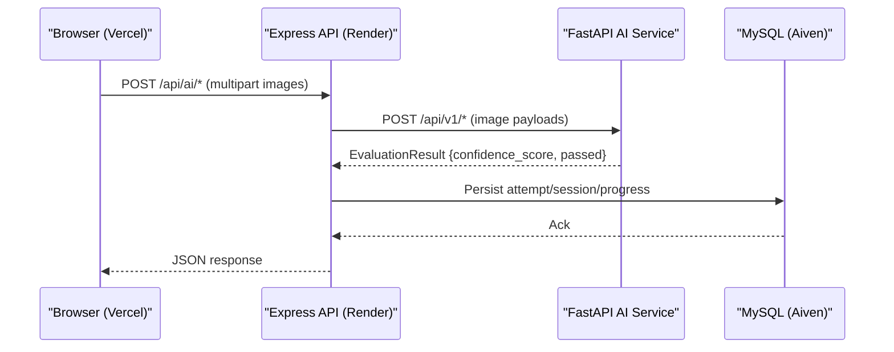
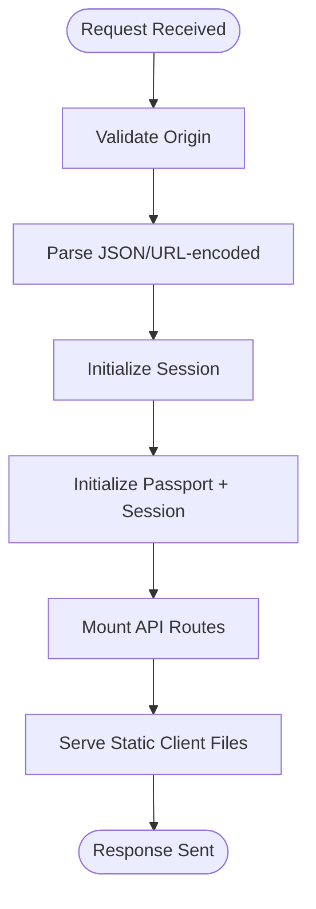
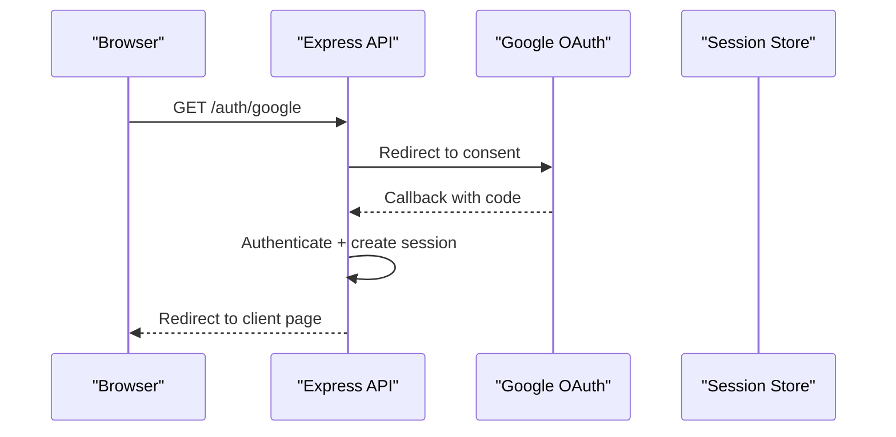
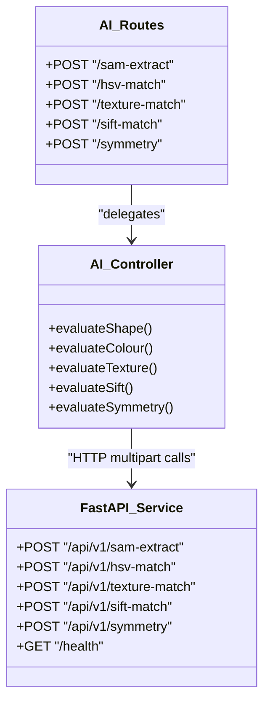
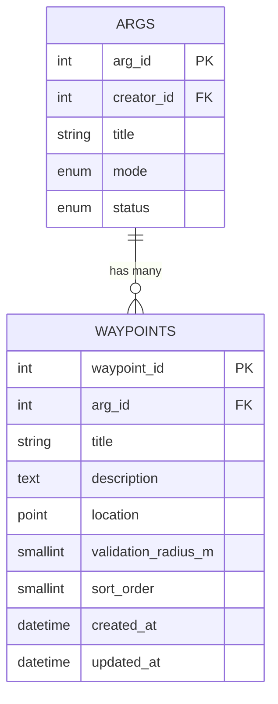
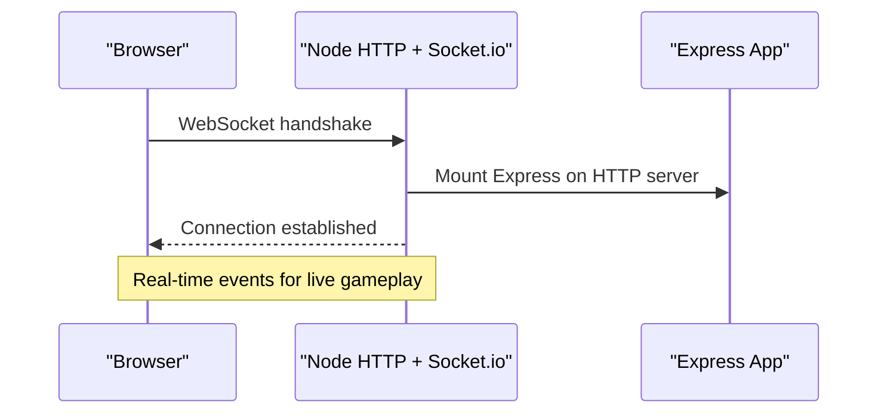
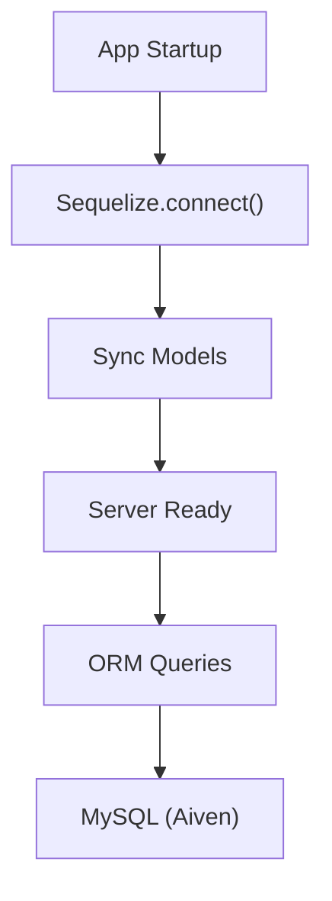
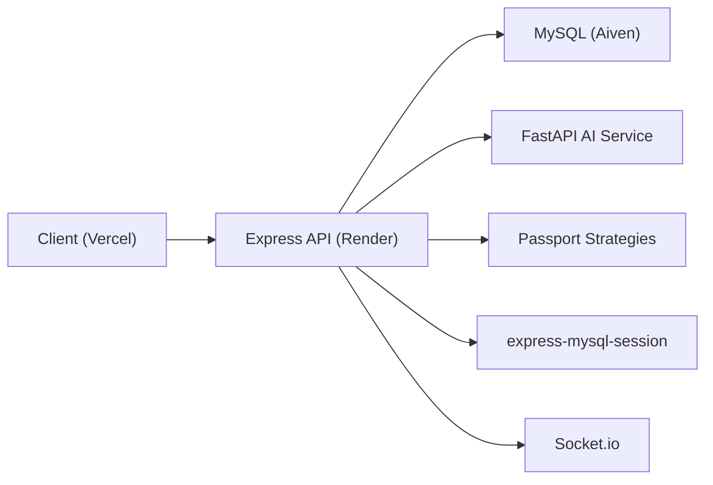

# System Architecture

<cite>
**Referenced Files in This Document**
- [README.md](file://README.md)
- [server.js](file://server/server.js)
- [app.js](file://server/src/app.js)
- [authRoutes.js](file://server/src/routes/authRoutes.js)
- [passport.js](file://server/src/config/passport.js)
- [database.js](file://server/src/config/database.js)
- [models/index.js](file://server/src/models/index.js)
- [Waypoint.js](file://server/src/models/Waypoint.js)
- [aiRoutes.js](file://server/src/routes/aiRoutes.js)
- [aiController.js](file://server/src/controllers/aiController.js)
- [main.py](file://ai-engine/main.py)
- [Dockerfile](file://ai-engine/Dockerfile)
- [schema.sql](file://database/schema.sql)
- [vercel.json](file://client/vercel.json)
</cite>

## Table of Contents
1. [Introduction](#introduction)
2. [Project Structure](#project-structure)
3. [Core Components](#core-components)
4. [Architecture Overview](#architecture-overview)
5. [Detailed Component Analysis](#detailed-component-analysis)
6. [Dependency Analysis](#dependency-analysis)
7. [Performance Considerations](#performance-considerations)
8. [Troubleshooting Guide](#troubleshooting-guide)
9. [Conclusion](#conclusion)

## Introduction
This document describes the WARG Platform’s microservices architecture and how its components interact to deliver a location-based Alternate Reality Game experience. The system separates responsibilities across:
- A Node.js backend API (Express) for authentication, game logic, geospatial validation, and real-time features.
- A Python AI microservice (FastAPI) for computer vision tasks such as shape matching, colour matching, texture analysis, SIFT archival matching, symmetry detection, and OCR plaque recognition.
- A static frontend served by Vercel.
- A managed MySQL database with spatial extensions on Aiven.

The platform is deployed across Render (backend), Vercel (frontend), and Aiven (MySQL). The design emphasizes secure evaluation of player submissions, robust session management, and scalable data flows for gameplay and analytics.

## Project Structure
At a high level, the repository contains:
- server: Express application, routes, controllers, models, middleware, and configuration.
- ai-engine: FastAPI service exposing image processing endpoints.
- client: Static HTML/CSS/JS assets served via Vercel.
- database: SQL schema defining relational and spatial tables.
- warg-docs: Documentation site.

```mermaid
graph TB
subgraph "Frontend"
FE["Static Client<br/>Vercel"]
end
subgraph "Backend API"
BE["Express App<br/>Render"]
Auth["Auth Routes<br/>Google OAuth + Local"]
Game["Game & Session Routes"]
Geo["Geospatial Validation"]
WS["Socket.io Real-time"]
end
subgraph "AI Microservice"
AI["FastAPI Vision Endpoints"]
end
subgraph "Data Layer"
DB["MySQL (Aiven)<br/>Spatial SRID 4326"]
end
FE --> BE
BE --> DB
BE --> AI
WS < --> FE
```

**Diagram sources**
- [README.md:62-108](file://README.md#L62-L108)
- [server.js:1-72](file://server/server.js#L1-L72)
- [app.js:1-132](file://server/src/app.js#L1-L132)
- [main.py:1-157](file://ai-engine/main.py#L1-L157)
- [schema.sql:1-691](file://database/schema.sql#L1-L691)

**Section sources**
- [README.md:62-108](file://README.md#L62-L108)

## Core Components
- Express Application: Configures CORS, sessions, Passport, mounts API routes, serves static client files, and integrates Socket.io for live features.
- Authentication: Google OAuth and local login strategies; session persistence via MySQL-backed store in production.
- AI Gateway: Express routes accept multipart uploads, validate inputs, and forward requests to the FastAPI AI service.
- Database: Relational schema with spatial POINT columns and indexes; ORM models define relationships and associations.
- Frontend: Static pages served from Vercel with rewrites to SPA-like routing.

Key implementation anchors:
- Express app assembly and route mounting.
- Passport configuration and OAuth callback handling.
- AI route definitions and controller forwarding.
- MySQL connection pooling and SSL options.
- Spatial model definition for waypoints.

**Section sources**
- [app.js:1-132](file://server/src/app.js#L1-L132)
- [authRoutes.js:1-72](file://server/src/routes/authRoutes.js#L1-L72)
- [passport.js:1-98](file://server/src/config/passport.js#L1-L98)
- [aiRoutes.js:1-40](file://server/src/routes/aiRoutes.js#L1-L40)
- [aiController.js:1-163](file://server/src/controllers/aiController.js#L1-L163)
- [database.js:1-38](file://server/src/config/database.js#L1-L38)
- [Waypoint.js:1-19](file://server/src/models/Waypoint.js#L1-L19)
- [vercel.json:1-9](file://client/vercel.json#L1-L9)

## Architecture Overview
The system follows a client-server microservices pattern:
- The browser loads static assets from Vercel and communicates with the Express API over HTTPS.
- The Express API handles authentication, game state, geolocation checks, and real-time events via Socket.io.
- For image-heavy evaluations, the Express API proxies requests to the FastAPI AI service using HTTP multipart uploads.
- All persistent data is stored in MySQL with spatial capabilities for geospatial queries.



**Diagram sources**
- [aiRoutes.js:1-40](file://server/src/routes/aiRoutes.js#L1-L40)
- [aiController.js:1-163](file://server/src/controllers/aiController.js#L1-L163)
- [main.py:73-157](file://ai-engine/main.py#L73-L157)
- [schema.sql:286-345](file://database/schema.sql#L286-L345)

## Detailed Component Analysis

### Express Server and Session Management
- The Express app configures CORS based on CLIENT_URL, sets trust proxy, and enables large payload limits for file uploads.
- Sessions are configured with secure cookies in production and persisted via MySQLStore when not in tests.
- Passport initializes and persists user identity into the session.



**Diagram sources**
- [app.js:26-128](file://server/src/app.js#L26-L128)

**Section sources**
- [app.js:1-132](file://server/src/app.js#L1-L132)

### Authentication Flow (Google OAuth and Local Login)
- Google OAuth redirects to Google’s consent screen, stores the original origin, and upon callback logs the user in and redirects to the client.
- Local login uses bcrypt to verify passwords and supports account status checks.



**Diagram sources**
- [authRoutes.js:1-72](file://server/src/routes/authRoutes.js#L1-L72)
- [passport.js:1-98](file://server/src/config/passport.js#L1-L98)

**Section sources**
- [authRoutes.js:1-72](file://server/src/routes/authRoutes.js#L1-L72)
- [passport.js:1-98](file://server/src/config/passport.js#L1-L98)

### AI Engine Integration
- Express routes under /api/ai accept multipart image uploads and forward them to FastAPI endpoints under /api/v1/*.
- The AI service validates an API key header and returns structured evaluation results with confidence scores and pass/fail decisions.



**Diagram sources**
- [aiRoutes.js:1-40](file://server/src/routes/aiRoutes.js#L1-L40)
- [aiController.js:1-163](file://server/src/controllers/aiController.js#L1-L163)
- [main.py:1-157](file://ai-engine/main.py#L1-L157)

**Section sources**
- [aiRoutes.js:1-40](file://server/src/routes/aiRoutes.js#L1-L40)
- [aiController.js:1-163](file://server/src/controllers/aiController.js#L1-L163)
- [main.py:1-157](file://ai-engine/main.py#L1-L157)

### Geospatial Data Model and Queries
- Waypoints use MySQL POINT geometry with SRID 4326 (WGS 84) and include spatial indexes for proximity checks.
- ORM model defines fields including title, description, location, validation radius, and sort order.



**Diagram sources**
- [schema.sql:160-179](file://database/schema.sql#L160-L179)
- [Waypoint.js:1-19](file://server/src/models/Waypoint.js#L1-L19)

**Section sources**
- [schema.sql:160-179](file://database/schema.sql#L160-L179)
- [Waypoint.js:1-19](file://server/src/models/Waypoint.js#L1-L19)

### Real-time Features (Socket.io)
- The server creates an HTTP server wrapping the Express app and attaches Socket.io with CORS settings aligned to CLIENT_URL.
- Connection lifecycle events are logged; additional room/channel logic can be added for live/co-op modes.



**Diagram sources**
- [server.js:1-72](file://server/server.js#L1-L72)

**Section sources**
- [server.js:1-72](file://server/server.js#L1-L72)

### Database Configuration and Persistence
- Sequelize connects to MySQL with SSL enabled in non-test environments and includes retry logic for transient network errors.
- Models index are centralized, defining associations between users, args, waypoints, minigames, sessions, attempts, and more.



**Diagram sources**
- [database.js:1-38](file://server/src/config/database.js#L1-L38)
- [models/index.js:1-135](file://server/src/models/index.js#L1-L135)

**Section sources**
- [database.js:1-38](file://server/src/config/database.js#L1-L38)
- [models/index.js:1-135](file://server/src/models/index.js#L1-L135)

### Frontend Deployment Configuration
- Vercel rewrites root path to the login page, enabling SPA-like navigation behavior for the static client.

**Section sources**
- [vercel.json:1-9](file://client/vercel.json#L1-L9)

## Dependency Analysis
The following diagram shows runtime dependencies among core services and data stores.



**Diagram sources**
- [README.md:62-108](file://README.md#L62-L108)
- [server.js:1-72](file://server/server.js#L1-L72)
- [app.js:1-132](file://server/src/app.js#L1-L132)
- [main.py:1-157](file://ai-engine/main.py#L1-L157)

**Section sources**
- [README.md:62-108](file://README.md#L62-L108)
- [server.js:1-72](file://server/server.js#L1-L72)
- [app.js:1-132](file://server/src/app.js#L1-L132)
- [main.py:1-157](file://ai-engine/main.py#L1-L157)

## Performance Considerations
- File Upload Limits: Multer is configured with memory storage and a 5MB limit per upload in AI routes. Ensure AI service and Express timeouts accommodate image sizes.
- Database Pooling: Sequelize pool size is set to 5 with explicit acquire/idle timeouts; consider tuning for concurrency and query patterns.
- SSL and Proxies: Trust proxy is enabled; ensure correct X-Forwarded-* headers from Render/Vercel.
- AI Service Scaling: The FastAPI service runs on CPU-only PyTorch; scale horizontally behind a load balancer if needed.
- Real-time Connections: Socket.io connections are stateless at the server level; consider sticky sessions or external adapters for multi-instance deployments.

[No sources needed since this section provides general guidance]

## Troubleshooting Guide
- AI Service Connectivity: If AI endpoints fail, check AI_SERVICE_URL and network reachability from Render. Validate that the AI service exposes the expected ports and accepts the required headers.
- Session Errors: In production, sessions are stored in MySQL. Verify DATABASE_URL connectivity and that express-mysql-session table creation succeeds.
- CORS Issues: Both Express and Socket.io enforce allowed origins from CLIENT_URL. Ensure the client domain matches the configured value.
- Database Connection Failures: Sequelize retries on common connection errors; confirm SSL requirements and credentials for Aiven MySQL.

**Section sources**
- [aiController.js:1-163](file://server/src/controllers/aiController.js#L1-L163)
- [app.js:50-84](file://server/src/app.js#L50-L84)
- [server.js:15-36](file://server/server.js#L15-L36)
- [database.js:1-38](file://server/src/config/database.js#L1-L38)

## Conclusion
The WARG Platform’s architecture cleanly separates concerns:
- Express manages authentication, game logic, geospatial validation, and real-time communication.
- FastAPI encapsulates computationally intensive image processing tasks.
- MySQL provides reliable persistence with spatial support for location-based gameplay.
- Vercel delivers a fast, static frontend.

This separation improves scalability, maintainability, and security while enabling advanced features like live co-op play and AI-driven evaluations.