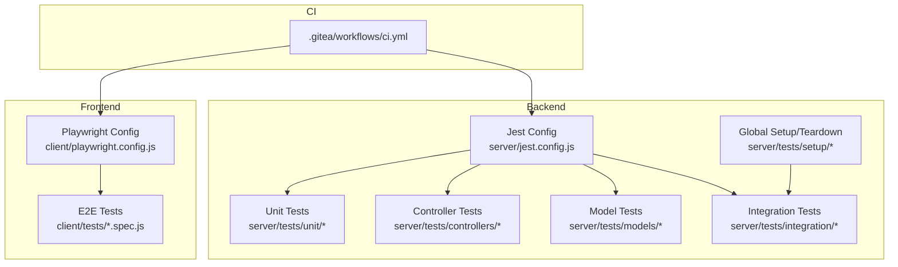
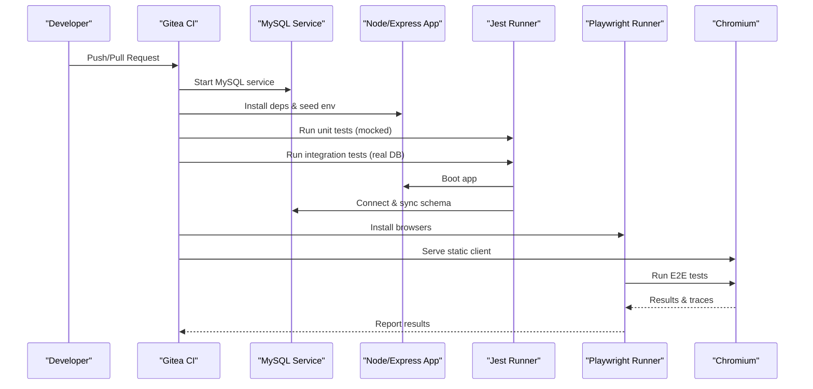
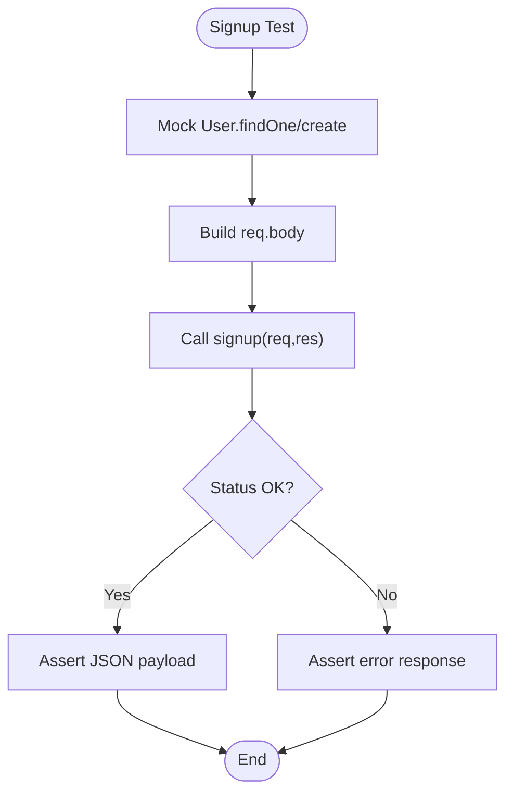
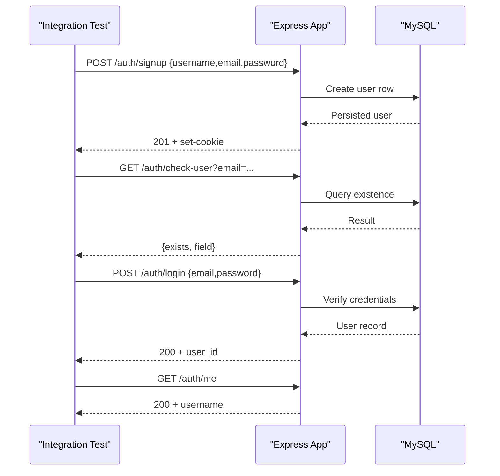
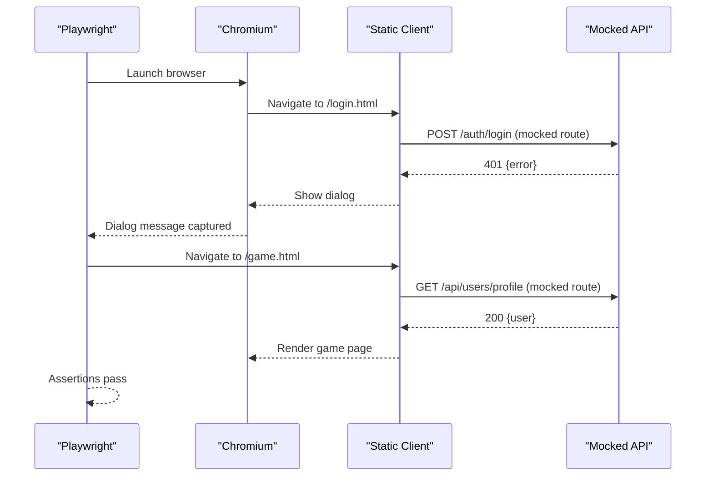
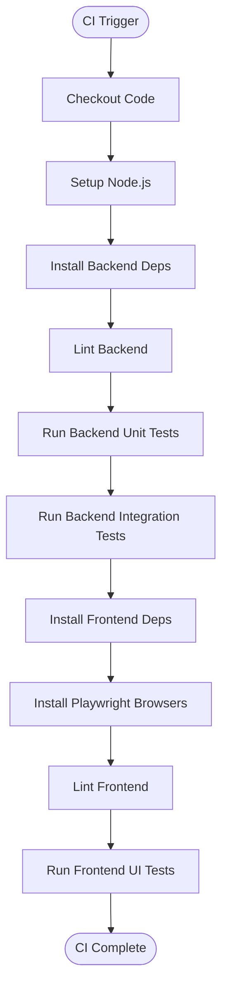
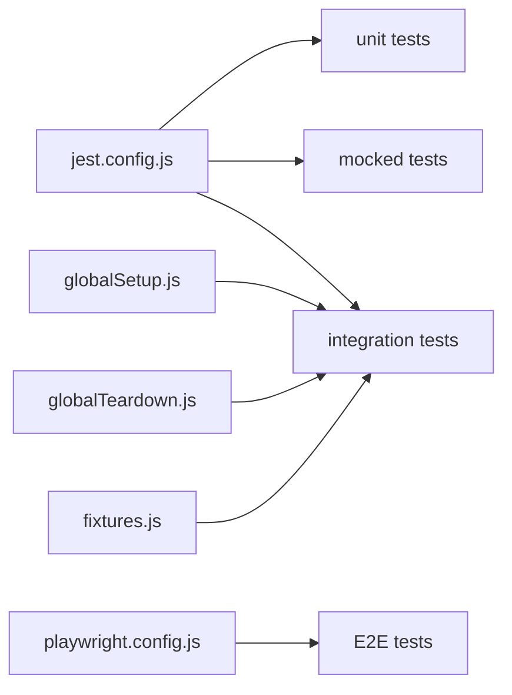

# Testing Strategy

<cite>
**Referenced Files in This Document**
- [README.md](file://README.md)
- [server/jest.config.js](file://server/jest.config.js)
- [server/tests/setup/globalSetup.js](file://server/tests/setup/globalSetup.js)
- [server/tests/setup/globalTeardown.js](file://server/tests/setup/globalTeardown.js)
- [server/tests/setup/jest.setup.js](file://server/tests/setup/jest.setup.js)
- [server/tests/setup/fixtures.js](file://server/tests/setup/fixtures.js)
- [server/tests/controllers/authController.test.js](file://server/tests/controllers/authController.test.js)
- [server/tests/models/User.test.js](file://server/tests/models/User.test.js)
- [server/tests/integration/auth.test.js](file://server/tests/integration/auth.test.js)
- [client/playwright.config.js](file://client/playwright.config.js)
- [client/tests/fixtures.js](file://client/tests/fixtures.js)
- [client/tests/login.spec.js](file://client/tests/login.spec.js)
- [client/tests/game.spec.js](file://client/tests/game.spec.js)
- [.gitea/workflows/ci.yml](file://.gitea/workflows/ci.yml)
</cite>

## Table of Contents
1. [Introduction](#introduction)
2. [Project Structure](#project-structure)
3. [Core Components](#core-components)
4. [Architecture Overview](#architecture-overview)
5. [Detailed Component Analysis](#detailed-component-analysis)
6. [Dependency Analysis](#dependency-analysis)
7. [Performance Considerations](#performance-considerations)
8. [Troubleshooting Guide](#troubleshooting-guide)
9. [Conclusion](#conclusion)

## Introduction
This document defines the testing strategy for the WARG Platform, covering unit tests with Jest for backend controllers, models, and utilities; integration tests for API endpoints, database interactions, and external service mocking; and end-to-end tests with Playwright for critical user workflows such as authentication, gameplay progression, and content creation. It also documents test organization, fixture management, CI setup, coverage reporting, debugging failed tests, and strategies to maintain reliability across geospatial validation, AI service integration, and real-time WebSocket communication.

The platform’s architecture and technology stack are summarized in the repository README, which identifies Node.js/Express, MySQL, Sequelize, Leaflet, Google OAuth, html5-QRCode, and Jest for testing.

**Section sources**
- [README.md:62-76](file://README.md#L62-L76)

## Project Structure
Testing is organized into three layers:
- Backend unit tests (Jest): controller logic, model definitions, and utility functions run against mocked dependencies.
- Backend integration tests (Jest + Supertest): HTTP endpoints exercised against a real MySQL instance provisioned by CI.
- Frontend E2E tests (Playwright): browser automation over the static client served locally during tests.

**Diagram sources**
- [server/jest.config.js:1-39](file://server/jest.config.js#L1-L39)
- [client/playwright.config.js:1-39](file://client/playwright.config.js#L1-L39)
- [.gitea/workflows/ci.yml:1-74](file://.gitea/workflows/ci.yml#L1-L74)

**Section sources**
- [server/jest.config.js:1-39](file://server/jest.config.js#L1-L39)
- [client/playwright.config.js:1-39](file://client/playwright.config.js#L1-L39)
- [.gitea/workflows/ci.yml:1-74](file://.gitea/workflows/ci.yml#L1-L74)

## Core Components
- Jest configuration splits tests into projects:
  - Mocked project for models/controllers/routes/config without DB access.
  - Unit project for isolated unit tests under server/tests/unit.
  - Integration project that boots a real MySQL via global hooks and runs server/tests/integration.
- Global setup enforces a test-only database URL guard, authenticates to MySQL, rebuilds schema, and closes connections.
- Fixtures provide helpers to create users and ARGs deterministically for integration tests.
- Playwright config serves the static client on localhost:8080, runs Chromium tests in parallel, collects traces on retry, and uses an HTML reporter.

Key responsibilities:
- Isolation: Controllers and models are tested with mocks to avoid side effects.
- Determinism: Integration tests rebuild the schema before each run.
- Safety: A guard prevents integration tests from running against non-test databases.
- Reliability: Playwright retries and trace collection aid debugging flaky UI flows.

**Section sources**
- [server/jest.config.js:1-39](file://server/jest.config.js#L1-L39)
- [server/tests/setup/globalSetup.js:1-21](file://server/tests/setup/globalSetup.js#L1-L21)
- [server/tests/setup/globalTeardown.js:1-6](file://server/tests/setup/globalTeardown.js#L1-L6)
- [server/tests/setup/fixtures.js:1-38](file://server/tests/setup/fixtures.js#L1-L38)
- [client/playwright.config.js:1-39](file://client/playwright.config.js#L1-L39)

## Architecture Overview
The testing architecture spans backend and frontend layers orchestrated by CI.

**Diagram sources**
- [.gitea/workflows/ci.yml:1-74](file://.gitea/workflows/ci.yml#L1-L74)
- [server/jest.config.js:1-39](file://server/jest.config.js#L1-L39)
- [client/playwright.config.js:1-39](file://client/playwright.config.js#L1-L39)

## Detailed Component Analysis

### Backend Unit Testing (Controllers, Models, Utilities)
Approach:
- Use Jest to mock external dependencies (models, bcrypt, etc.).
- Validate request/response contracts, error paths, and business rules.
- Keep tests fast and deterministic by avoiding network or DB calls.

Example patterns:
- Controller signup flow validates inputs, checks uniqueness, hashes passwords, logs in, and returns appropriate status codes.
- Model definition tests assert that Sequelize.define is invoked with correct parameters.

**Diagram sources**
- [server/tests/controllers/authController.test.js:1-115](file://server/tests/controllers/authController.test.js#L1-L115)

**Section sources**
- [server/tests/controllers/authController.test.js:1-115](file://server/tests/controllers/authController.test.js#L1-L115)
- [server/tests/models/User.test.js:1-28](file://server/tests/models/User.test.js#L1-L28)

### Backend Integration Testing (API Endpoints, Database Interactions)
Approach:
- Use Supertest to send HTTP requests to the Express app.
- Use fixtures to create deterministic data.
- Rely on global setup to ensure a clean, test-only database schema.

Key flows:
- POST /auth/signup creates a user and issues a session cookie.
- GET /auth/check-user reports existing email/username.
- POST /auth/login + GET /auth/me validate session-based auth.
- GET /auth/logout invalidates the session.

**Diagram sources**
- [server/tests/integration/auth.test.js:1-121](file://server/tests/integration/auth.test.js#L1-L121)
- [server/tests/setup/fixtures.js:1-38](file://server/tests/setup/fixtures.js#L1-L38)
- [server/tests/setup/globalSetup.js:1-21](file://server/tests/setup/globalSetup.js#L1-L21)

**Section sources**
- [server/tests/integration/auth.test.js:1-121](file://server/tests/integration/auth.test.js#L1-L121)
- [server/tests/setup/globalSetup.js:1-21](file://server/tests/setup/globalSetup.js#L1-L21)
- [server/tests/setup/fixtures.js:1-38](file://server/tests/setup/fixtures.js#L1-L38)

### Frontend End-to-End Testing (Playwright)
Approach:
- Serve the static client via Playwright’s webServer configuration.
- Use page.route to mock API responses for stable scenarios.
- Collect JS coverage on Chromium using monocart-reporter.

Critical workflows:
- Authentication: Render login form, handle validation errors, and assert dialog messages when API returns 401.
- Gameplay progression: Load game page, mock profile endpoint to bypass redirects, and assert basic DOM visibility.

**Diagram sources**
- [client/playwright.config.js:1-39](file://client/playwright.config.js#L1-L39)
- [client/tests/fixtures.js:1-24](file://client/tests/fixtures.js#L1-L24)
- [client/tests/login.spec.js:1-36](file://client/tests/login.spec.js#L1-L36)
- [client/tests/game.spec.js:1-21](file://client/tests/game.spec.js#L1-L21)

**Section sources**
- [client/playwright.config.js:1-39](file://client/playwright.config.js#L1-L39)
- [client/tests/fixtures.js:1-24](file://client/tests/fixtures.js#L1-L24)
- [client/tests/login.spec.js:1-36](file://client/tests/login.spec.js#L1-L36)
- [client/tests/game.spec.js:1-21](file://client/tests/game.spec.js#L1-L21)

### Test Organization and Fixture Management
- Backend:
  - Organize tests by layer: controllers, models, routes, config, unit, integration.
  - Use shared fixtures for creating users and ARGs with unique identifiers and hashed passwords.
  - Configure Jest projects to isolate mocked vs. real DB scenarios.
- Frontend:
  - Extend Playwright’s base test to start/stop JS coverage on Chromium and integrate with monocart-reporter.
  - Centralize common page navigation and API mocking patterns in spec files.

Best practices:
- Keep fixtures small and composable.
- Use unique names to avoid collisions in concurrent tests.
- Prefer explicit assertions on status codes and payloads.

**Section sources**
- [server/jest.config.js:1-39](file://server/jest.config.js#L1-L39)
- [server/tests/setup/fixtures.js:1-38](file://server/tests/setup/fixtures.js#L1-L38)
- [client/tests/fixtures.js:1-24](file://client/tests/fixtures.js#L1-L24)

### Continuous Integration Setup
CI pipeline provisions a MySQL service, installs dependencies, lints code, runs backend unit and integration tests, then sets up Playwright and runs frontend UI tests.

**Diagram sources**
- [.gitea/workflows/ci.yml:1-74](file://.gitea/workflows/ci.yml#L1-L74)

**Section sources**
- [.gitea/workflows/ci.yml:1-74](file://.gitea/workflows/ci.yml#L1-L74)

### Writing Tests for Specific Domains

#### Geospatial Validation
- Strategy:
  - For controller-level validation, mock location inputs and assert server-side distance checks and thresholds.
  - For integration tests, insert waypoints with POINT geometry and assert query results using spatial functions.
  - For E2E, mock map interactions and verify that attempts outside allowed radius are rejected.

Tips:
- Use deterministic coordinates and radii in fixtures.
- Validate both valid and invalid proximity cases.

[No sources needed since this section provides general guidance]

#### AI Service Integration
- Strategy:
  - Mock AI endpoints at the controller level to return expected analysis results.
  - In integration tests, stub external HTTP calls to the AI engine and assert processing outcomes.
  - In E2E, intercept AI-related API calls and simulate success/failure to validate UI feedback.

Tips:
- Include latency simulation to test timeouts and retries.
- Cover error paths like malformed responses and rate limits.

[No sources needed since this section provides general guidance]

#### Real-Time WebSocket Communication
- Strategy:
  - For unit tests, mock socket events and assert handler behavior.
  - For integration tests, use a test harness to emit and capture socket events alongside HTTP flows.
  - For E2E, connect a headless client to the running server and assert state changes after receiving events.

Tips:
- Ensure deterministic event ordering and cleanup of listeners.
- Add timeouts and reconnection handling in tests.

[No sources needed since this section provides general guidance]

### Test Coverage Reporting
- Backend:
  - Jest can be configured to produce coverage reports; ensure coverage thresholds are enforced in CI if desired.
- Frontend:
  - Playwright tests extend the base test to start JS coverage on Chromium and report via monocart-reporter.

Recommendations:
- Track coverage trends over time rather than hard thresholds alone.
- Exclude generated or vendored code from coverage.

**Section sources**
- [client/tests/fixtures.js:1-24](file://client/tests/fixtures.js#L1-L24)

### Debugging Failed Tests
- Backend:
  - Increase Jest timeout for slow integration tests.
  - Inspect database state by temporarily disabling schema reset and querying the test DB.
- Frontend:
  - Enable Playwright traces on first retry to visualize failures.
  - Use page screenshots and console logs to pinpoint UI issues.

Operational notes:
- The Jest setup extends default timeouts for stability.
- Playwright is configured to collect traces on retry and run with an HTML reporter.

**Section sources**
- [server/tests/setup/jest.setup.js:1-2](file://server/tests/setup/jest.setup.js#L1-L2)
- [client/playwright.config.js:1-39](file://client/playwright.config.js#L1-L39)

### Maintaining Test Reliability
- Isolate tests:
  - Use mocks for external services and DB for unit tests.
  - Rebuild schema for integration tests to ensure deterministic state.
- Guardrails:
  - Enforce test-only database URLs to prevent accidental writes to production.
- Parallelism:
  - Run unit tests in parallel; limit workers on CI for E2E to reduce flakiness.
- Data hygiene:
  - Use unique identifiers in fixtures to avoid collisions.
- Observability:
  - Collect traces and coverage artifacts in CI for post-mortem analysis.

**Section sources**
- [server/tests/setup/globalSetup.js:1-21](file://server/tests/setup/globalSetup.js#L1-L21)
- [client/playwright.config.js:1-39](file://client/playwright.config.js#L1-L39)

## Dependency Analysis
The following diagram shows how test components depend on configuration and setup modules.

**Diagram sources**
- [server/jest.config.js:1-39](file://server/jest.config.js#L1-L39)
- [server/tests/setup/globalSetup.js:1-21](file://server/tests/setup/globalSetup.js#L1-L21)
- [server/tests/setup/globalTeardown.js:1-6](file://server/tests/setup/globalTeardown.js#L1-L6)
- [server/tests/setup/fixtures.js:1-38](file://server/tests/setup/fixtures.js#L1-L38)
- [client/playwright.config.js:1-39](file://client/playwright.config.js#L1-L39)

**Section sources**
- [server/jest.config.js:1-39](file://server/jest.config.js#L1-L39)
- [server/tests/setup/globalSetup.js:1-21](file://server/tests/setup/globalSetup.js#L1-L21)
- [server/tests/setup/globalTeardown.js:1-6](file://server/tests/setup/globalTeardown.js#L1-L6)
- [server/tests/setup/fixtures.js:1-38](file://server/tests/setup/fixtures.js#L1-L38)
- [client/playwright.config.js:1-39](file://client/playwright.config.js#L1-L39)

## Performance Considerations
- Prefer unit tests for fast feedback; keep integration tests minimal and focused on critical paths.
- Use mocks for heavy operations (AI, OCR, AR) to avoid slow external calls.
- Limit E2E parallelism on CI to reduce resource contention and flakiness.
- Avoid unnecessary DB resets within individual tests; rely on global setup to prepare a clean schema once per suite.

[No sources needed since this section provides general guidance]

## Troubleshooting Guide
Common issues and resolutions:
- Integration tests refuse to run due to DATABASE_URL not matching test expectations:
  - Ensure the environment variable points to a test database containing the expected identifier.
- Flaky E2E tests:
  - Enable Playwright traces and review the HTML report for timing issues.
  - Stabilize API mocks and add explicit waits for dynamic content.
- Slow backend tests:
  - Reduce bcrypt cost factor in fixtures for tests only.
  - Split long-running suites and run them separately.

**Section sources**
- [server/tests/setup/globalSetup.js:1-21](file://server/tests/setup/globalSetup.js#L1-L21)
- [client/playwright.config.js:1-39](file://client/playwright.config.js#L1-L39)
- [server/tests/setup/fixtures.js:1-38](file://server/tests/setup/fixtures.js#L1-L38)

## Conclusion
The WARG Platform’s testing strategy combines fast, isolated unit tests with robust integration and E2E suites. Jest projects separate concerns between mocked and real-database scenarios, while Playwright automates critical user journeys with reliable reporting and tracing. CI orchestrates all layers, ensuring consistent quality gates. By following the patterns outlined here—especially around fixtures, mocking, and safety guards—the team can maintain high confidence in geospatial validations, AI integrations, and real-time features while keeping tests fast and reliable.