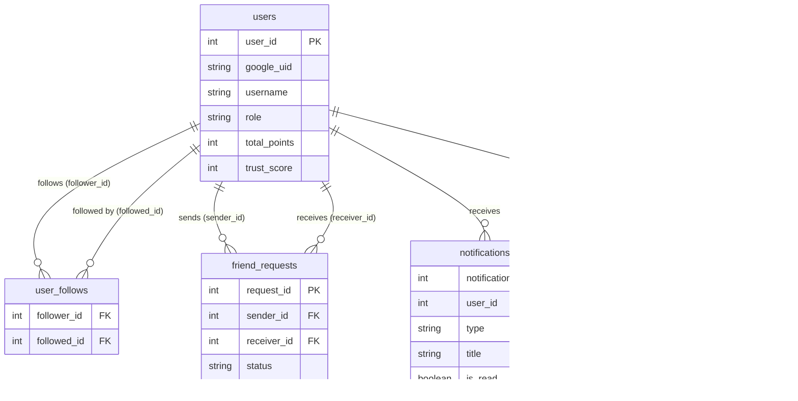
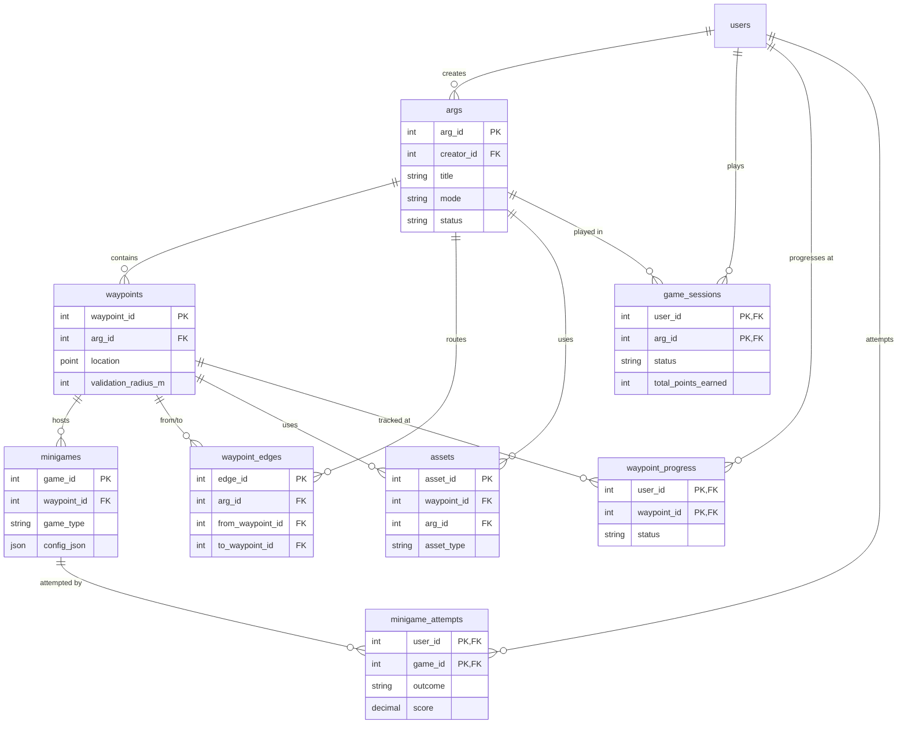
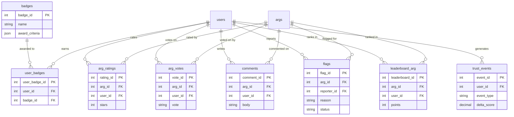

# Database Schema

The WARG platform relies on a MySQL database, extensively using spatial extensions (SRID 4326 / WGS 84) to manage real-world coordinates and geographical boundaries.

Rather than presenting the raw SQL, the schema is visualized below in logical groupings.

## 1. Users, Social & Notifications

This module handles core identities, authentications, player connections, and alerts.

## 2. ARGs, Waypoints & Gameplay

This forms the core engine of the platform. ARGs contain Waypoints, which are connected via Edges and host Minigames. Player progression through these is tracked through sessions, waypoint progress, and individual minigame attempts.

## 3. Community, Moderation & Meta-Progression

This module covers player feedback (ratings, comments), safety (flags, location trust events), and long-term progression (badges, leaderboards).

