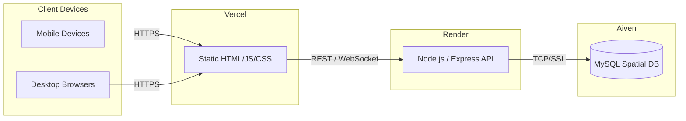

# Deployment Guide

This document covers the full hosting setup for the WARG Platform across its three infrastructure layers:

| Layer | Service | Role |
|-------|---------|------|
| Database | [Aiven for MySQL](https://aiven.io) | Managed MySQL with spatial extensions & SSL |
| Backend | [Render](https://render.com) | Node.js / Express API server |
| Frontend | [Vercel](https://vercel.com) | Static HTML/CSS/JS client delivery |

### Architecture Overview



---

## Prerequisites

- A [Git-E](https://gitea.io) / GitHub / GitLab repository containing this codebase.
- Accounts created on [Aiven](https://aiven.io), [Render](https://render.com), and [Vercel](https://vercel.com).
- Node.js >= 18 installed locally for testing before deployment.

---

## 1. Aiven — MySQL Database

Aiven provides a fully managed MySQL service. The WARG platform uses MySQL's **spatial extensions** (SRID 4326 / WGS 84) to store ARG waypoints as `POINT`, `LINESTRING`, and `POLYGON` geometry types. Aiven enforces SSL on all connections, which is already handled in `server/src/config/database.js`.

### 1.1 Creating a MySQL Service

1. Log in to [console.aiven.io](https://console.aiven.io).
2. Click **Create service** → choose **MySQL**.
3. Select your preferred cloud provider and region (choose the region closest to your Render backend for low latency).
4. Choose a plan (the free-tier **Hobbyist** plan is sufficient for development).
5. Name the service (e.g., `warg-mysql`) and click **Create service**.
6. Wait for the service state to change to **Running** (typically 1–3 minutes).

### 1.2 Obtaining the Connection URI

1. From your service dashboard, open the **Overview** tab.
2. Under **Connection information**, locate the **Service URI**. It will look like:
   ```
   mysql://avnadmin:<password>@<host>.aivencloud.com:<port>/defaultdb?ssl-mode=REQUIRE
   ```
3. Copy this full URI — this becomes your `DATABASE_URL` environment variable.

> **Note:** Aiven uses `defaultdb` as the default schema name. You can create a dedicated schema (e.g., `wargdb`) from the **Databases** tab if needed.

### 1.3 SSL Configuration

The Aiven MySQL service requires SSL. This is already configured in the database adapter:

```js
// server/src/config/database.js
dialectOptions: {
  ssl: {
    require: true,
    rejectUnauthorized: false   // Accepts Aiven's self-signed CA cert
  }
}
```

> **Security note for production:** Download the **CA Certificate** from the Aiven service dashboard and set `rejectUnauthorized: true`, passing the cert via the `ca` field. This validates the server identity and prevents MITM attacks.

### 1.4 Running Migrations / Seeding

After connecting, run Sequelize sync to initialise the schema:

```bash
# From the /server directory
node -e "const db = require('./src/config/database'); db.sync({ force: false }).then(() => { console.log('DB synced'); process.exit(0); })"
```

For a clean slate during development, use `force: true` (WARNING: **drops all tables**).

### 1.5 Monitoring & Backups

- Aiven performs **automated daily backups** with point-in-time recovery on paid plans.
- Monitor query performance from the **Metrics** tab in the Aiven console.
- Connection pool exhaustion is a common issue on the Hobbyist plan — keep Sequelize's `pool.max` at &lt;= 5.

---

## 2. Render — Backend Hosting

Render hosts the Node.js / Express backend (`/server`). It provides zero-downtime deploys, automatic HTTPS, and native environment variable management.

### 2.1 Creating a Web Service

1. Log in to [dashboard.render.com](https://dashboard.render.com).
2. Click **New** → **Web Service**.
3. Connect your Git provider and select the WARG Platform repository.
4. Configure the service:

   | Setting | Value |
   |---------|-------|
   | **Name** | `warg-backend` (or similar) |
   | **Region** | Closest to your Aiven MySQL region |
   | **Branch** | `main` (or your production branch) |
   | **Root Directory** | `server` |
   | **Runtime** | `Node` |
   | **Build Command** | `npm install` |
   | **Start Command** | `npm start` |
   | **Instance Type** | Free (development) / Starter (production) |

5. Click **Create Web Service**.

### 2.2 Environment Variables

From the Render service dashboard, go to **Environment** and add the following variables:

| Key | Value |
|-----|-------|
| `DATABASE_URL` | Your full Aiven MySQL URI (from §1.2) |
| `PORT` | `3000` (Render also injects its own `PORT`; Express reads from `process.env.PORT`) |
| `NODE_ENV` | `production` |

> **Tip:** Render also supports secret files (`.env` format) via **Secret Files** in the service settings if you prefer storing multiple variables in one place.

### 2.3 Auto-Deploy on Push

Render automatically redeploys whenever a commit is pushed to the configured branch. To disable this, toggle **Auto-Deploy** off in the service settings and trigger deploys manually.

### 2.4 Health Checks

Render pings a health-check endpoint to confirm the service is live. Add a lightweight health route to `server.js` if not already present:

```js
app.get('/health', (req, res) => res.status(200).json({ status: 'ok' }));
```

Configure the **Health Check Path** in Render's service settings to `/health`.

### 2.5 WebSocket Support (Socket.io)

The WARG platform uses **Socket.io** for live co-op and PvP gameplay (live-play ARGs, Point Domination, Landmark Relay). Render's free tier supports WebSockets on the same port as HTTP without any additional configuration — Socket.io's polling fallback also works out of the box.

> **Important:** Render's free-tier web services **spin down after 15 minutes of inactivity**. For WebSocket-dependent features, upgrade to at least the **Starter** plan to prevent connection drops during active gameplay sessions.

### 2.6 Viewing Logs

From the Render dashboard, select your service and click the **Logs** tab. Live streaming logs are available for real-time debugging. For production, consider forwarding logs to a service like Papertrail or Logtail via Render's **Log Streams** feature.

---

## 3. Vercel — Frontend Hosting

Vercel hosts the static HTML/CSS/JS client located in the `/client` directory. It provides global CDN delivery, automatic HTTPS, and preview deployments for every pull request.

### 3.1 Importing the Project

1. Log in to [vercel.com](https://vercel.com) and click **Add New → Project**.
2. Import the WARG Platform repository from your Git provider.
3. Configure the project:

   | Setting | Value |
   |---------|-------|
   | **Framework Preset** | `Other` (plain static site) |
   | **Root Directory** | `client` |
   | **Build Command** | *(leave blank — no build step required)* |
   | **Output Directory** | `.` (the `client` folder itself is the output) |

4. Click **Deploy**.

### 3.2 Routing Static HTML Pages

The WARG frontend is a multi-page application (MPA) with individual `.html` files:

- `home.html` — Landing page & active ARG listing
- `game.html` — In-game geolocation & puzzle view
- `studio.html` — Creator studio for plotting ARG nodes
- `edit_warg.html` — ARG editing interface
- `catalogue.html` — Browse published ARGs
- `analytics.html` — Creator performance dashboards
- `admin.html` — Administrator oversight panel
- `user-profile.html` — Player profile
- `friend-profile.html` — Social following view

Vercel serves each file at its corresponding path by default (e.g., `https://your-app.vercel.app/game.html`).

To enable cleaner URLs (e.g., `/game` instead of `/game.html`), add a `vercel.json` file in the `client` directory:

```json
{
  "cleanUrls": true,
  "trailingSlash": false
}
```

### 3.3 Connecting the Frontend to the Backend

After deploying to Render, your backend URL will look like:

```
https://warg-backend.onrender.com
```

Update all `fetch()` calls in the client scripts to reference the production backend URL. The recommended approach is a single constant at the top of each relevant script file:

```js
// At the top of each script file (e.g., scripts/studio.js)
const API_BASE = 'https://warg-backend.onrender.com';

// Then use it consistently:
const response = await fetch(`${API_BASE}/api/wargs`);
```

For local development, point this to `http://localhost:3000`.

### 3.4 Environment Variables (Vercel)

Vercel environment variables are designed for server-side rendering frameworks (Next.js, etc.). Since the WARG frontend is plain static HTML/JS with no build step, there is no environment variable injection at build time. All configuration (e.g., the API base URL) should be managed as JavaScript constants within the script files, or via a small shared `config.js` file served alongside the HTML.

### 3.5 Custom Domain

To attach a custom domain (e.g., `warg.wits.ac.za`):

1. Go to your Vercel project → **Settings** → **Domains**.
2. Add your domain and follow the DNS configuration instructions (typically a `CNAME` or `A` record).
3. Vercel automatically provisions and renews an SSL certificate via Let's Encrypt.

### 3.6 Preview Deployments

Every pull/merge request automatically gets a unique preview URL (e.g., `https://warg-platform-git-feature-branch.vercel.app`). This is useful for reviewing frontend changes without affecting the production deployment.

---

## Environment Variables Reference

All environment variables for the backend are defined in `server/.env.example`. Copy this file to `server/.env` for local development:

```bash
cp server/.env.example server/.env
```

Then fill in your actual Aiven credentials:

```env
PORT=3000
DATABASE_URL="mysql://avnadmin:<password>@<host>.aivencloud.com:<port>/defaultdb?ssl-mode=REQUIRE"
NODE_ENV=development
```

| Variable | Required | Description |
|----------|----------|-------------|
| `DATABASE_URL` | Yes | Full Aiven MySQL connection URI including credentials and SSL flag |
| `PORT` | Optional | Defaults to `3000`; Render injects its own value automatically |
| `NODE_ENV` | Optional | Set to `production` on Render to suppress dev-only logging |

> **Never commit your `.env` file.** It is listed in `.gitignore`. Use Render's **Environment** tab to manage secrets in production.

---

## Deployment Checklist

Use this checklist before every production release:

### Database (Aiven)
- [ ] Aiven service is in **Running** state
- [ ] `DATABASE_URL` has been copied from the Aiven console (Overview tab)
- [ ] Schema has been synced (`db.sync`)
- [ ] Spatial indexes are present on `POINT`, `LINESTRING`, and `POLYGON` columns

### Backend (Render)
- [ ] `DATABASE_URL` environment variable is set in Render's **Environment** tab
- [ ] `NODE_ENV=production` is set
- [ ] Root Directory is set to `server`
- [ ] Start Command is `npm start`
- [ ] `/health` endpoint returns `200 OK`
- [ ] WebSocket connections verified (if deploying live-play features)
- [ ] Render service is on a paid plan if WebSocket uptime is required

### Frontend (Vercel)
- [ ] `API_BASE` constants in client scripts point to the production Render URL
- [ ] Root Directory is set to `client`
- [ ] All HTML pages load correctly at their expected paths
- [ ] CORS is configured on the Express server to allow requests from the Vercel domain
- [ ] `vercel.json` is present in `client/` if clean URLs are desired

### CORS Configuration

Ensure the Express backend explicitly allows requests from the Vercel frontend domain. In `server/server.js`:

```js
const cors = require('cors');

app.use(cors({
  origin: [
    'http://localhost:3000',          // Local frontend dev
    'http://127.0.0.1:5500',          // VS Code Live Server
    'https://your-app.vercel.app',    // Vercel production deployment
  ],
  credentials: true
}));
```
