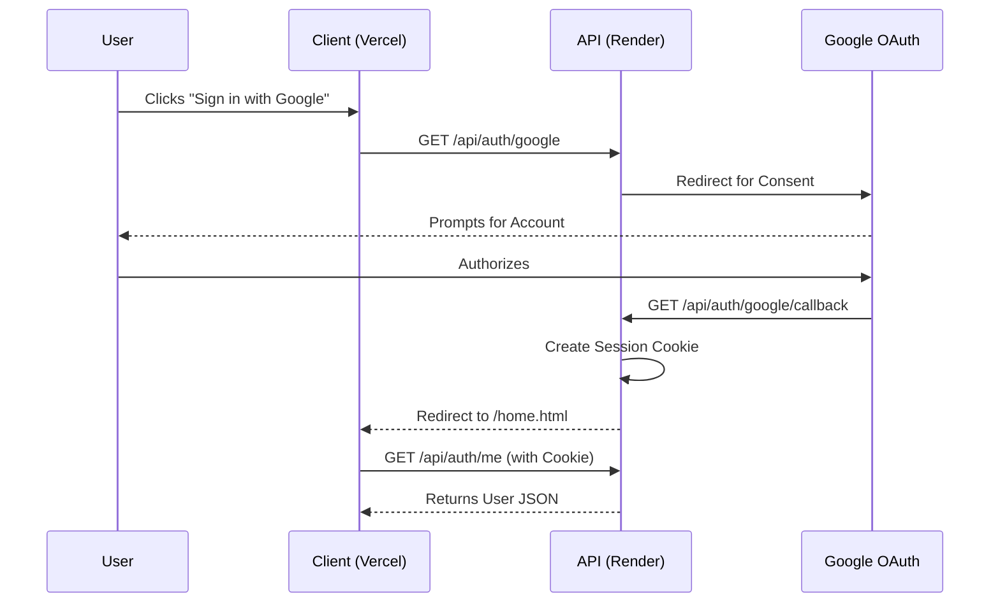

# Authentication API

The WARG platform uses Google OAuth 2.0 via Passport.js for all authentication. 

All endpoints reside under the `/api/auth` prefix. Authentication relies on standard session cookies (`connect.sid`).

## Endpoints

### 1. `GET /api/auth/google`

Initiates the Google OAuth 2.0 login flow. Redirects the client browser to Google's consent screen.

**Requirements**: None (Public)

### 2. `GET /api/auth/google/callback`

The callback endpoint where Google redirects the user after authentication. The server validates the OAuth token and establishes a session.

- **On Success:** Redirects to `/home.html` on the client.
- **On Failure:** Redirects to `/login.html?error=<reason>` (e.g., `auth_failed`, `server_error`).

### 3. `GET /api/auth/me`

Retrieves the currently authenticated user's profile data. This is typically used by the frontend on every page load to check if a valid session exists.

**Requirements**: Valid Session Cookie

**Response (200 OK):**
```json
{
  "user_id": 1,
  "username": "Father Fakir",
  "email": "fakir@example.com",
  "role": "player",
  "avatar": "https://lh3.googleusercontent.com/a/..."
}
```

**Response (401 Unauthorized):**
```json
{
  "error": "Not authenticated"
}
```

### 4. `GET /api/auth/logout`

Destroys the user's session on the server and clears the session cookie.

- **Action:** Destroys session.
- **Redirects to:** `/login.html`

---

## Authentication Flow


