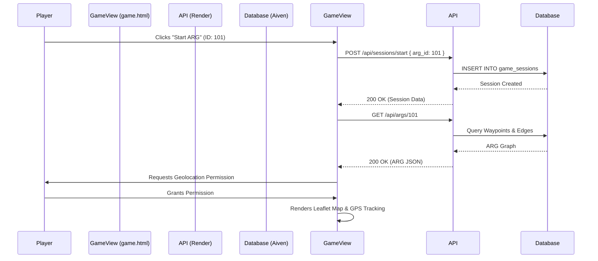
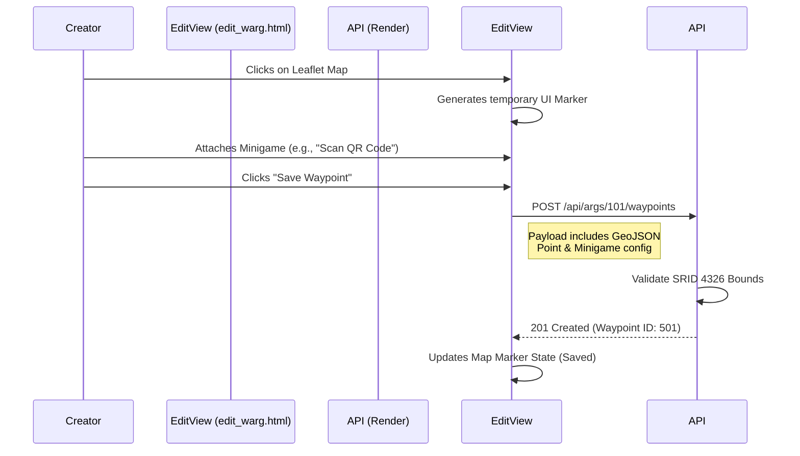
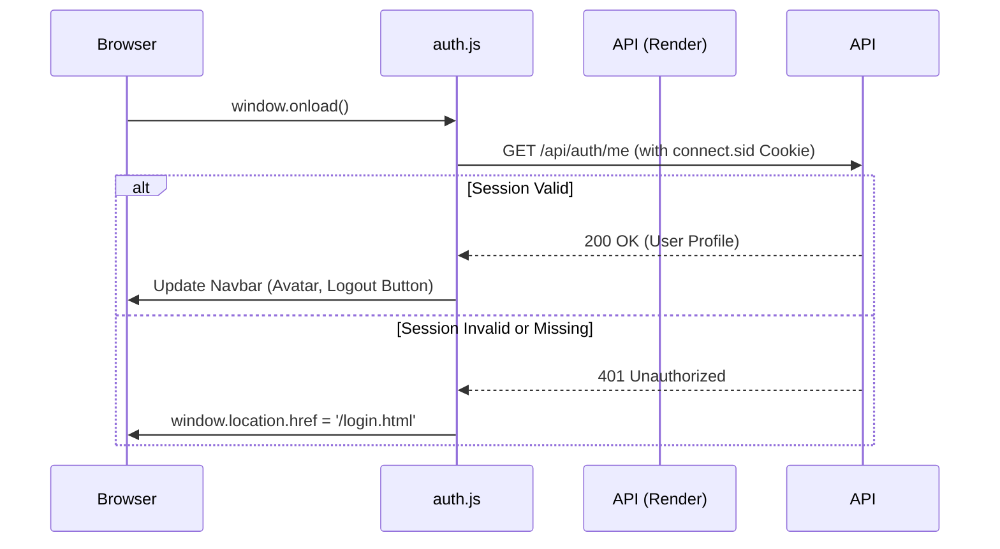

# System Flows

The interactions between the static Multi-Page Application (MPA) frontend and the Express REST API can be complex. Below are the key system flows visualized.

## 1. Starting an ARG (Gameplay Flow)

When a player selects an ARG from the catalogue and clicks "Start", the system must initialize a session and retrieve the initial state.

## 2. Creator Studio: Plotting a Waypoint

When a creator clicks on the map in `edit_warg.html` to add a new physical location for a challenge.

## 3. Session Validation

Because the frontend is entirely static, it must verify the user's authentication status dynamically on every authenticated page load using a shared `auth.js` utility.

