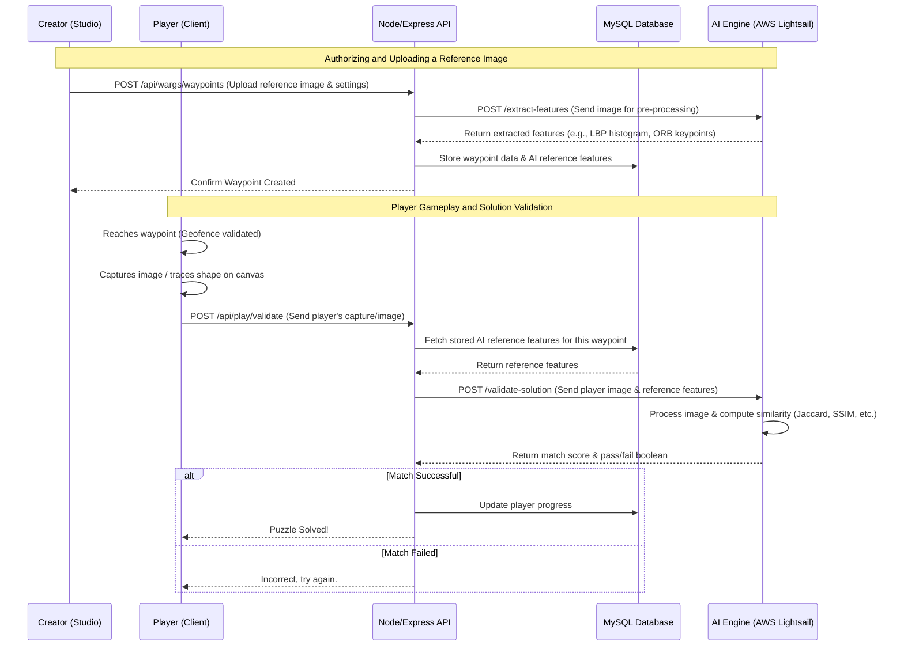

# AI Engine Data Flow

The AI Engine processes computer vision and machine learning tasks (such as shape matching, color matching, and texture matching) for the WARG Platform. The data flow from the moment an author uploads a reference image to when a player uploads their solution is outlined below.

## Architecture & Data Flow

## Description of the Flow

### 1. Author Upload
- **Studio Interface**: Creators upload images, logos, or patterns in the Studio dashboard.
- **Express Backend**: The backend receives the image and immediately proxies it to the AI Engine for pre-processing.
- **AI Engine**: Generates a set of reference features (such as local binary patterns for textures, keypoints for ORB/SIFT, or histograms for color-matching).
- **Storage**: Rather than storing raw images, the backend stores these lightweight extracted features in the database alongside the waypoint's geometry and metadata. This saves space and speeds up validation.

### 2. Player Validation
- **Client Capture**: While playing the ARG, the player's device captures an image or canvas drawing via the AR overlay.
- **Express Backend**: The client payload is sent to the backend. The backend queries the database to retrieve the *reference features* previously stored for the puzzle.
- **AI Engine Validation**: The backend forwards the player's new image and the stored reference features to the AI Engine. The AI Engine computes a distance metric (such as Jaccard Index for shapes, SSIM for symmetry, or Chi-squared distance for textures).
- **Resolution**: Based on a configurable threshold, the AI Engine returns a similarity score and a binary result (pass/fail). The backend then records the progress and notifies the client.
